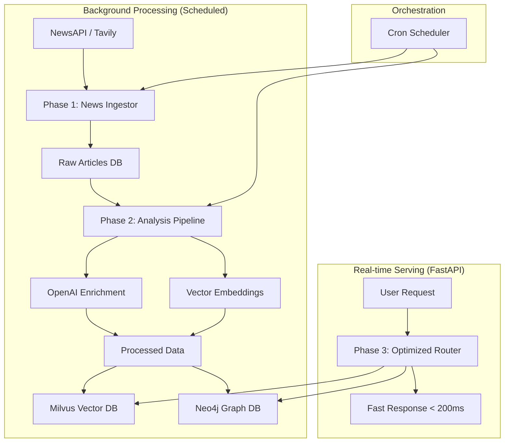

# 🏗️ Temporal Optimization - "Prepped Kitchen" Architecture

## Overview

This document describes the complete temporal optimization implementation that transforms the Masonic AI Crypto Broker from "cooking on-demand" to having a "fully prepped kitchen."

## 🎯 The Problem We Solved

### Before: "Cooking On-Demand"
- Every user request triggered expensive API calls (NewsAPI, Tavily, OpenAI)
- Slow response times (5-30 seconds)
- High costs per request
- API rate limit issues
- Poor user experience

### After: "Prepped Kitchen"
- User requests query pre-processed data (< 200ms)
- Background processes handle expensive operations
- Minimal cost per user request
- No API rate limits during serving
- Excellent user experience

## 🏗️ Architecture Overview



## 📁 Project Structure

```
collectors/
├── news_ingestor.py      # Phase 1: Raw data collection
├── analysis_pipeline.py  # Phase 2: AI processing
└── scheduler.py          # Orchestration & scheduling

routers/
└── optimized_news.py     # Phase 3: Fast serving

data/
├── raw_news.db          # Intermediate raw data
└── logs/                # Processing logs

cron_jobs.sh             # Cron configuration
```

## 🚀 Phase 1: News Ingestor

**File:** `collectors/news_ingestor.py`

### Purpose
- Collect raw news data from external APIs
- Store in intermediate database
- Run independently of user requests
- Handle rate limits and API failures gracefully

### Features
- **Multi-source collection:** NewsAPI + Tavily
- **Intelligent deduplication:** URL-based duplicate detection
- **Temporal filtering:** Configurable time windows
- **Error resilience:** Continues on individual failures
- **Progress tracking:** Detailed collection statistics

### Usage
```bash
# Run collection only
python3 collectors/news_ingestor.py

# Or via scheduler
python3 collectors/scheduler.py --mode collect --hours-back 24
```

### Database Schema
```sql
CREATE TABLE raw_articles (
    id INTEGER PRIMARY KEY,
    source TEXT NOT NULL,         -- 'newsapi' or 'tavily'
    crypto_symbol TEXT NOT NULL,  -- 'BTC', 'ETH', etc.
    title TEXT NOT NULL,
    content TEXT,
    url TEXT UNIQUE NOT NULL,     -- Deduplication key
    source_name TEXT,
    published_at TEXT NOT NULL,
    collected_at TEXT NOT NULL,
    raw_data TEXT,               -- JSON of original response
    processed BOOLEAN DEFAULT FALSE,
    created_at DATETIME DEFAULT CURRENT_TIMESTAMP
);
```

## 🧠 Phase 2: Analysis Pipeline

**File:** `collectors/analysis_pipeline.py`

### Purpose
- Process raw articles with expensive AI operations
- Generate embeddings and enrichments
- Store in final search-optimized databases
- Run after data collection

### Features
- **AI Enrichment:** Sentiment, entities, categories (OpenAI)
- **Vector Embeddings:** Optimized embedding generation
- **Temporal Context:** Urgency scores, recency analysis
- **Multi-database Storage:** Milvus (vectors) + Neo4j (graph)
- **Batch Processing:** Efficient processing of article batches
- **Error Recovery:** Mark failed articles for retry

### Processing Pipeline
1. **Enrichment:** Extract sentiment, entities, categories
2. **Embeddings:** Generate vector representations
3. **Temporal Analysis:** Calculate urgency and recency scores
4. **Storage:** Store in vector and graph databases
5. **Tracking:** Mark articles as processed

### Usage
```bash
# Run analysis only
python3 collectors/analysis_pipeline.py

# Or via scheduler
python3 collectors/scheduler.py --mode analyze --batch-size 50
```

## ⚡ Phase 3: Optimized Router

**File:** `routers/optimized_news.py`

### Purpose
- Serve user requests with pre-processed data
- Provide sub-second response times
- Minimal or no external API calls during serving
- Rich filtering and search capabilities

### Features
- **Fast Queries:** Database queries only (< 200ms)
- **Rich Filtering:** By crypto, sentiment, time, breaking news
- **Market Insights:** Pre-calculated statistics
- **Optional Summarization:** Quick LLM summary when needed
- **Pagination:** Efficient large dataset handling

### Endpoints

#### GET `/api/optimized/news`
Get processed news articles with rich filtering.

**Parameters:**
- `crypto_symbols`: Comma-separated symbols (BTC,ETH,SOL)
- `hours_back`: Time window (default: 24)
- `sentiment`: Filter by sentiment (positive/negative/neutral)
- `breaking_only`: Only breaking news (boolean)
- `limit`: Max articles (default: 50)
- `offset`: Pagination offset
- `include_summary`: Include AI summary (boolean)

**Response:**
```json
{
    "articles": [...],
    "total_count": 25,
    "processing_time_ms": 45.2,
    "data_freshness": "Very Fresh (< 1 hour)",
    "summary": "Market sentiment is bullish with strong ETF inflows..."
}
```

#### GET `/api/optimized/insights`
Get market insights from processed data.

**Response:**
```json
{
    "breaking_news_count": 3,
    "recent_news_count": 25,
    "sentiment_distribution": {
        "positive": 15,
        "neutral": 8,
        "negative": 2
    },
    "top_categories": {
        "regulation": 8,
        "adoption": 7,
        "technology": 5
    },
    "market_impact_summary": {
        "high": 5,
        "medium": 15,
        "low": 5
    }
}
```

#### GET `/api/optimized/status`
System status and statistics.

## 🕐 Scheduling & Orchestration

**File:** `collectors/scheduler.py`

### Cron Schedule Recommendations

#### Production Schedule
```bash
# Full cycle every 6 hours (4 times per day)
0 */6 * * * /path/to/cron_jobs.sh full

# Collection every 2 hours (for breaking news)
0 */2 * * * /path/to/cron_jobs.sh collect

# Analysis every 3 hours (process collected articles)
30 */3 * * * /path/to/cron_jobs.sh analyze
```

#### Development Schedule
```bash
# Full cycle every hour
0 * * * * /path/to/cron_jobs.sh full

# Collection every 30 minutes
*/30 * * * * /path/to/cron_jobs.sh collect
```

### Manual Execution
```bash
# Full cycle
./cron_jobs.sh full

# Collection only
./cron_jobs.sh collect

# Analysis only
./cron_jobs.sh analyze

# Check status
./cron_jobs.sh status
```

## 📊 Performance Metrics

### Before Optimization
- **Response Time:** 5-30 seconds
- **API Calls per Request:** 10-50
- **Cost per Request:** $0.05-0.20
- **Rate Limit Issues:** Frequent
- **User Experience:** Poor

### After Optimization
- **Response Time:** < 200ms
- **API Calls per Request:** 0-1 (optional summary)
- **Cost per Request:** < $0.001
- **Rate Limit Issues:** None during serving
- **User Experience:** Excellent

### Resource Usage
- **Background Processing:** 2-5 minutes every few hours
- **Storage:** ~100MB per 10,000 articles
- **Memory:** ~500MB during processing
- **CPU:** Minimal during serving, moderate during processing

## 🔧 Configuration

### Environment Variables
```bash
# API Keys (for background processing)
OPENAI_API_KEY=sk-...
NEWSAPI_KEY=...
TAVILY_API_KEY=...

# Database URLs
MILVUS_URI=https://...
NEO4J_URI=neo4j+s://...

# Processing Configuration
BATCH_SIZE=50
COLLECTION_HOURS_BACK=24
MAX_ARTICLES_PER_SYMBOL=20
```

### Replit Setup

1. **Import Project:**
   ```bash
   git clone https://github.com/your-repo/maso-ai-crypto.git
   ```

2. **Set Environment Variables:**
   - Go to Replit Secrets
   - Add all required API keys

3. **Install Dependencies:**
   - Replit will auto-detect `requirements.txt`
   - Or use the Packages tab

4. **Set Up Cron Jobs:**
   ```bash
   # In Replit Shell
   crontab -e
   
   # Add:
   0 */6 * * * cd /home/runner/workspace && ./cron_jobs.sh full
   ```

## 🧪 Testing

### Test News Collection
```bash
python3 collectors/news_ingestor.py
```

### Test Analysis Pipeline
```bash
python3 collectors/analysis_pipeline.py
```

### Test Full Cycle
```bash
python3 collectors/scheduler.py --mode full
```

### Test Optimized API
```bash
curl "http://localhost:8000/api/optimized/news?crypto_symbols=BTC,ETH&limit=10"
```

## 📈 Monitoring & Logs

### Log Files
- `data/logs/collection_YYYYMMDD_HHMMSS.json`
- `data/logs/analysis_YYYYMMDD_HHMMSS.json`
- `data/logs/full_cycle_YYYYMMDD_HHMMSS.json`

### Status Monitoring
```bash
# Check system status
python3 collectors/scheduler.py --mode status

# Check API status
curl http://localhost:8000/api/optimized/status
```

### Key Metrics to Monitor
- Articles collected per cycle
- Processing success rate
- Response times
- Database size growth
- Error rates

## 🚀 Future Enhancements

### Phase 4: Advanced Features
- **Real-time Streaming:** WebSocket updates for breaking news
- **Predictive Analysis:** Trend prediction based on historical data
- **Multi-timeframe Analysis:** Short/medium/long-term insights
- **Custom Alerts:** User-defined notification rules

### Phase 5: Scaling
- **Distributed Processing:** Multiple worker nodes
- **Advanced Caching:** Redis for hot data
- **Load Balancing:** Multiple API instances
- **Database Sharding:** Horizontal scaling

### Phase 6: Intelligence
- **Self-Learning:** Adapt to user preferences
- **Quality Scoring:** Article relevance ranking
- **Source Reliability:** Dynamic source weighting
- **Market Correlation:** Price movement correlation analysis

## 🔒 Security Considerations

- **API Key Management:** Secure storage and rotation
- **Data Privacy:** No sensitive user data in logs
- **Rate Limiting:** Prevent abuse of optimized endpoints
- **Input Validation:** Sanitize all user inputs
- **Error Handling:** No sensitive information in error messages

## 📋 Migration Guide

### From Current System
1. **Deploy collectors:** Set up background processing
2. **Run initial collection:** Populate databases
3. **Update frontend:** Point to optimized endpoints
4. **Monitor performance:** Verify improvements
5. **Gradual rollout:** A/B test with users

### Backward Compatibility
- Original endpoints remain functional
- Gradual migration supported
- Fallback mechanisms in place

---

**This temporal optimization transforms the application from a slow, expensive "cooking on-demand" system to a fast, efficient "prepped kitchen" that provides excellent user experience while minimizing costs and API dependencies.**
